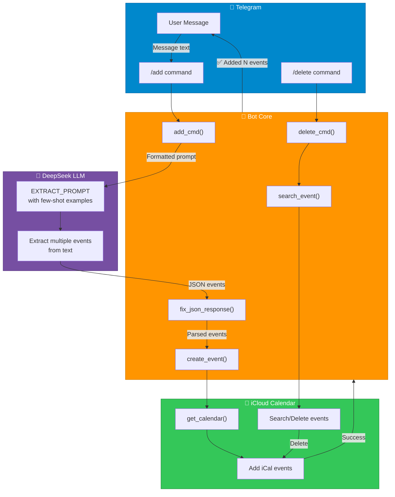
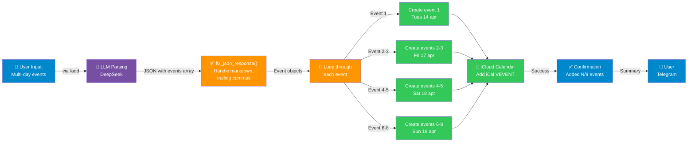
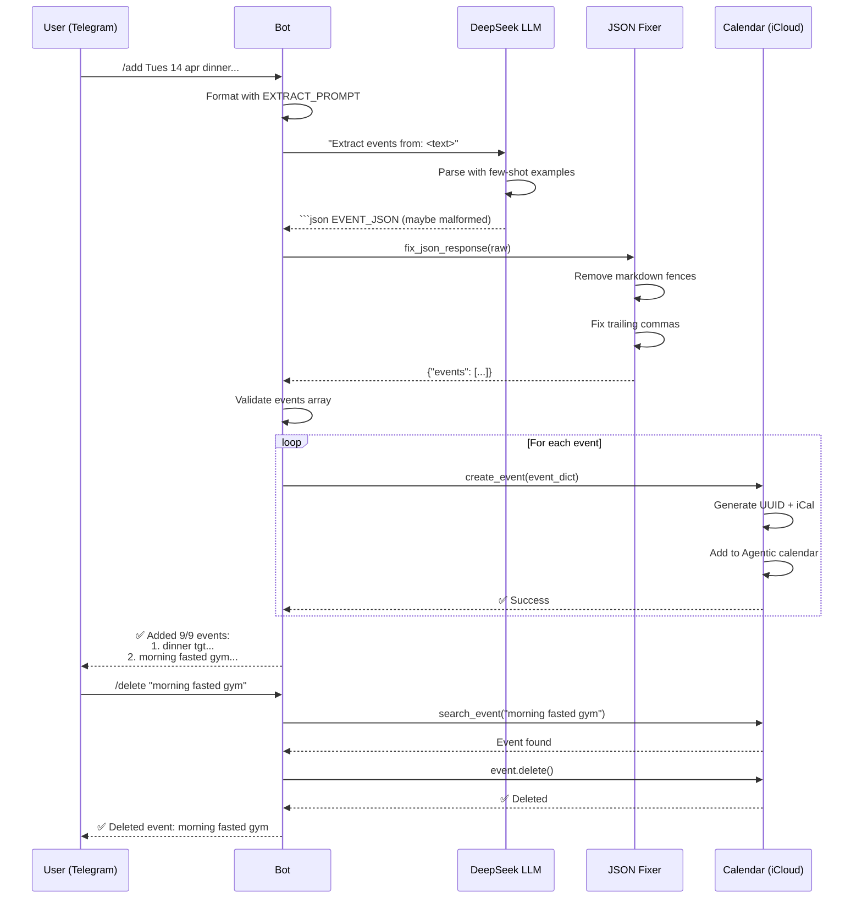

# 🤖 Telegram Calendar Bot

A Telegram bot powered by DeepSeek LLM that manages your iCloud calendar via CalDAV. Hosted on fly.io.

## How It Works

```
You (Telegram) → Bot → DeepSeek (extracts event details) → CalDAV → iCloud Calendar
```

The bot listens to your messages, uses DeepSeek to extract calendar event information, and automatically creates/deletes events in your iCloud calendar.

---

## Setup

### 1. Get a Telegram Bot Token
- Open Telegram → search `@BotFather`
- Send `/newbot` and follow prompts
- Copy your **bot token**

### 2. Get a DeepSeek API Key
- Go to https://platform.deepseek.com
- Create an API key

### 3. Get iCloud Credentials
- Your Apple ID email as `ICLOUD_USER`
- An [app-specific password](https://support.apple.com/en-us/102654) as `ICLOUD_APP_PASS`
- Have a calendar named "Agentic" in iCloud, make it available for public.

### 4. Local Development
```bash
pip install -r requirements.txt
export TELEGRAM_TOKEN="your-token"
export DEEPSEEK_API_KEY="your-key"
export ICLOUD_USER="your@icloud.com"
export ICLOUD_APP_PASS="your-app-specific-password"
python bot.py
```

### 5. Deploy to fly.io
```bash
flyctl launch
flyctl secrets set TELEGRAM_TOKEN="..." DEEPSEEK_API_KEY="..." ICLOUD_USER="..." ICLOUD_APP_PASS="..."
flyctl deploy
```

---

## Usage

### Basic Commands

**Add Event(s)** — `/add` with event details:
```
/add Tues 14 apr dinner tgt, clar stayover
/add tomorrow gym at 7am for 1h
/add "Meeting Friday 3-4pm @ Conference Room"
```

**Multi-Event Support** — Add multiple events at once:
```
/add Tues 14 apr
dinner tgt, clar stayover
--- u decide where to eat

Fri 17 apr
- morning fasted gym
- lunch @ chalao
- 330pm 1.5h yupinzudao massage 

Sat 18 apr
-11am gardenvista
- 2pm dainstree

Sun 19 apr
- 945-1030am clar spin orchard. rch FH at 1110am
- 1130am capri
- 4pm suites de laurel
```
Result: ✅ Added 9/9 events

**Delete Event** — `/delete <keyword>`:
```
/delete gym
/delete "chalao lunch"
```

### Supported Time Formats
- `330pm` → 15:30
- `945-1030am` → 09:45 (45 min duration)
- `1.5h` → 90 minutes
- `tomorrow`, `next Friday` → automatic date inference
- `Tues 14 apr` → flexible date parsing

### How LLM Extraction Works
The bot uses **few-shot examples** in the prompt to understand your format:
- Parses dates like "Tues 14 apr" → YYYY-MM-DD
- Extracts abbreviated times like "330pm" → HH:MM
- Infers durations from context ("1.5h" = 90 min)
- Filters non-event text ("u decide where to eat" is ignored)
- Handles multi-line, multi-day event lists

---

## Usage Examples

Just send natural language messages to your bot:

| Message | Result |
|---------|--------|
| "Add meeting tomorrow at 3pm" | Creates single event |
| "Schedule lunch Fri 12-1pm @ chalao" | Creates event with location |
| "/delete meeting" | Deletes event matching keyword |
| Multi-day block with bullet points | Creates all events in list |

---

## Architecture

```
bot.py
 ├── Telegram message handler  (python-telegram-bot)
 ├── LLM event extraction      (DeepSeek API)
 ├── JSON fixer                (Handle malformed responses)
 ├── Calendar operations       (CalDAV/iCloud)
 └── HTTP health check         (Port 8080 for fly.io)
```

### System Architecture
```
┌─────────────┐      ┌──────────────────┐      ┌──────────────┐
│  Telegram   │──→   │   Bot Core       │──→   │   iCloud     │
│   (User)    │      │  ├─ Parser       │      │  Calendar    │
│             │      │  ├─ JSON Fixer   │      │  (CalDAV)    │
│             │      │  └─ Creator      │      │              │
└─────────────┘      │                  │      └──────────────┘
                     │  ┌────────────┐  │
                     │  │ DeepSeek   │  │
                     │  │ LLM        │  │
                     │  └────────────┘  │
                     └──────────────────┘
```

#### Component Diagram


### Multi-Event Processing Flow
When you send multiple events in one message:



#### Step-by-Step Event Flow
When you send `/add` with multiple events:



### Event Extraction
1. User sends message to Telegram bot with `/add` command
2. DeepSeek LLM extracts **all** schedulable events (using few-shot examples)
3. `fix_json_response()` handles:
   - Markdown code fences (removes ` ```json ... ``` `)
   - Trailing commas in JSON
   - Embedded JSON extraction
4. Each event validated and created as iCal VEVENT
5. Bot confirms count and summary to user

### Delete Flow
1. User sends `/delete <keyword>`
2. Bot searches iCloud calendar for matching event summary
3. Bot deletes first matching event
4. Bot confirms deletion with event title

---

## Features

### ✅ Multi-Event Parsing
Extract and create **multiple events from a single message**. Perfect for sharing weekly schedules, itineraries, or event lists.

### ✅ Robust JSON Handling
The `fix_json_response()` helper function handles common LLM response issues:
- Removes markdown code fences (` ```json `)
- Fixes trailing commas
- Extracts embedded JSON from text
- Gracefully falls back if unparseable

### ✅ Flexible Date/Time Parsing
Via LLM few-shot examples:
- `330pm` → 15:30
- `945-1030am` → 09:45 with 45min duration
- `Tues 14 apr` → YYYY-MM-DD with year inference
- Relative dates → tomorrow, next Friday, etc.

### ✅ Location Extraction
Automatically extracts location from event descriptions:
- `lunch @ dimsum` → title: "lunch", location: "dimsum"
- `gym` → leaves location as empty string

### ✅ Noise Filtering
Thanks to few-shot prompting, bot ignores non-event text:
- "u decide where to eat" → skipped (not an event)
- "(Context notes)" → not extracted as separate events

---

| Variable | Required | Description |
|----------|----------|-------------|
| `TELEGRAM_TOKEN` | Yes | Telegram bot token from @BotFather |
| `DEEPSEEK_API_KEY` | Yes | DeepSeek API key |
| `ICLOUD_USER` | Yes | Apple ID email |
| `ICLOUD_APP_PASS` | Yes | App-specific password from Apple ID |

---

## Deployment Notes

- **Platform**: fly.io (Singapore region)
- **HTTP Server**: Runs on port 8080 for health checks
- **Calendar**: Uses CalDAV to sync with iCloud (works from any OS)
- **Polling**: Bot uses long polling (no webhook setup required)
